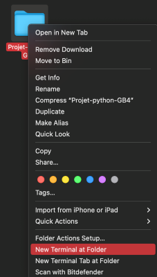

# Projet GB4: Analyse d'une fiche PDB

Pour bien visualiser le readme, veuillez le consulter sur: https://github.com/Edmondbrn/Projet-python-GB4


## Etapes d'installation

1. Instaler la version Python 3 (3.10/3.11 idéalement ou au-delà) en cliquant sur ce lien:
   https://www.python.org/downloads/release/python-3115/
   /!\ Lors de l'installation cochez la case "Ajouter Python aux variable de chemin" (PATH) pour le bon fonctionnement du programme

2. Installer les modules complémentaires nécessaires en utilisant le fichier 
   module.bat (windows) ou module.sh (Linux et MacOS).
   Attention, ces fichiers nécessitent d'avoir pip installé sur le système  d'exploitation. Si vous avez conda par défaut veuillez le modifier (ou alors remplacez pip install par conda install en ouvrant les fichiers dans une éditeur de texte).
   Normalement, pip devrait être installé si l'étape 1 est respectée (variable PATH).

3. Pour exécuter le fichier .bat il suffit de double cliquer dessus.    
   Pour le fichier .sh il faut l'éxécuter depuis le terminal du système d'exploitation    
   Pour ce faire, aller dans le dossier général (contenant module.sh), faites clique droit --> ouvrir un terminal    

   

   Entrer:
   ``` bash
   bash module.sh
   <!-- Pour Linux -->
   ```   
   ``` sh
   sh module.sh
   <!-- Pour MacOS utilisant Bash -->
   ```   
   ``` zsh
   zsh module.sh
   <!-- Pour MacOS utilisant Zsh -->
   ```

4. Double cliquez sur le fichier "Application.py" présent dans le dossier "Script". Si tout se passe bien, une fenêtre devrait s'ouvrir.     
   Pour Linux, vous pouvez utiliser la commande:   
   ``` bash
   python3 application.py
   <!-- Pour Linux, vérifier que vous êtes au bon endroit Projet_python_GB4/Script -->
   ```

#
## Utilisation

 1. Le logiciel permet de charger en ligne ou en local une fiche PDB (exemple: 1CRN.pdb, fourni) 

 2. Le logiciel a besoin d'une connexion internet pour fonctionner au mieux

 3. Si vous voulez ouvrir une fiche en local, veuillez respecter la nomenclature de l'exemple 1CRN (Données-->1CRN)

 4. Tous les documents téléchargées seront présents dans un dossier portant le nom de la fiche PDB dans le dossier "Données"


## Mise à jour

Le dossier complet du programme peut être téléchargé depuis Github:
https://github.com/Edmondbrn/Projet-python-GB4


## Note

Il se peut que la fonctionnalité de la matrice de contact mette du temps à répondre si la séquence protéique est importante
Cela vaut aussi pour la fiche pymol en fonction des fréquences d'apparition des acides aminés.

## Auteurs

Berne Edmond    
Collomb Maud    
Duwez Léa       
Fleury Anaïs
