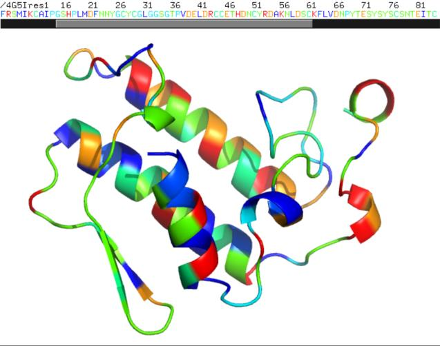
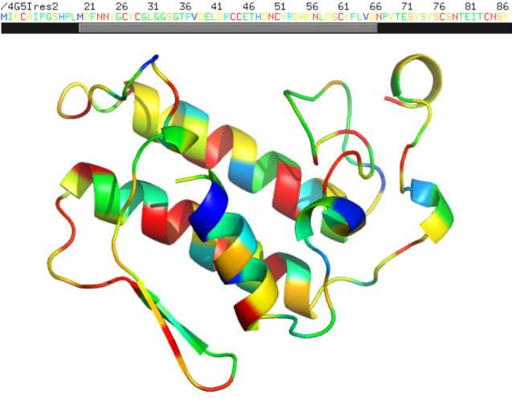
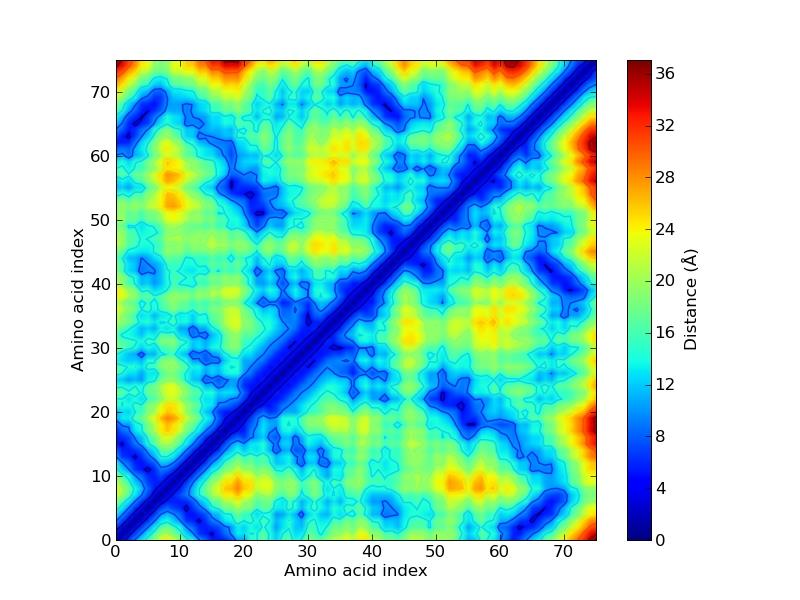

---
output:
  html_document: default
  pdf_document: default
---
Projet Extraction info. Biol. Python – GB4 2023

## Modalités du rendu

### Rendu écrit

Votre projet se composera d’une archive (.gz, .zip, …) qui devra être rendu pour le vendredi 5 janvier en n’oubliant pas d’indiquer vos noms (dans le nom de l’archive et dans les fichiers sources).

- Contenant le/les fichiers sources python (.py), les documents associés en n’oubliant pas de mettre des commentaires sur les principales lignes de votre programme.
- Un document (10 pages maximum) permettant d’expliquer votre projet, le contexte biologique, votre stratégie, vos remarques sur ce projet ou sur les résultats.

### Rendu oral

Un oral de 5 minutes par groupe sera organisé le jeudi 11 janvier.

## Infos

Votre programme devra être robuste vis à vis de l'utilisateur, des données récupérées, des résultats obtenus (peut ne pas avoir de résultat) et devra gérer au mieux les erreurs possibles sans entrainer d’arrêt non souhaité du programme. Le programme devra par exemple informer l'utilisateur si le fichier utilisé correspond à une entrée incomplète ou ne correspond pas au fichier attendu.

## Documentation fournie

### Fichier PDB

- [Documentation PDB](http://www.wwpdb.org/documentation/file-format-content/format33/v3.3.html)
- [Exemple de fichier d'entrée](http://files.rcsb.org/view/1CRN.pdb)
- [La SwissProt](https://web.expasy.org/docs/relnotes/relstat.html)
- Formule hydrophobicité : $<H> = \frac{1}{N} \sum_{n=1}^{N} H_n$
- [Echelle de l'hydrophobicité](https://web.expasy.org/protscale/pscale/Hphob.Fauchere.html)
- [Description de la ligne atom](http://www.wwpdb.org/documentation/file-format-content/format33/sect9.html#ATOM)

## Objectif du programme

Analyse d’une structure protéique au format PDB

Les différentes fonctionnalités pourront être proposées sous forme d’un menu avec un choix demandé à l’utilisateur. (contrainte ou recommandation ??)

### Analyses

Différentes analyses seront effectuées sur ces données et seront stockées dans des fichiers de résultats.

Description succincte (Vous êtes libre de rajouter des fonctionnalités ou des analyses qui vous sembleraient pertinentes) :

Votre programme devra :

- Récupérer le contenu d’un fichier au format PDB
  - soit par l’interrogation du site web PDB en récupérant le .pdb (voir Documentation)
  - soit par l’ouverture d’un fichier PDB présent sur votre ordinateur.
- Récupérer des informations importantes sur la protéine
  - description,
  - longueur de la protéine,
- Récupérer la méthode expérimentale utilisée avec la résolution éventuellement associée.

- Construire la séquence au format fasta de cette protéine
  - et proposez de l’enregistrer (dans un fichier)
  - et de l’afficher. (`print(ma_sequence)`)

- Faire une analyse de la composition en acide aminé de la protéine et comparer ce résultat à la fréquence moyenne des acides aminés dans une protéine (basée par exemple sur la SwissProt, cf Documentation).
- Calculer le profil d’hydrophobicité de cette protéine
- Détecter la présence éventuelle de ponts-disulfures,
  - afficher la liste des ponts-disulfures
    et/ou
  - des cystéines libres.

- Proposer un format de fichier de sortie regroupant les différentes analyses.

- Construire un fichier PDB de cette structure en changeant le champ "Temperature factor ou B-factor" (champ d'un format PDB) par des valeurs tenant compte de la physico-chimie des résidus ou de la composition en acide aminé.
- **Bonus** : calculer la matrice de contact de la protéine et proposer d’écrire un fichier compatible à une visualisation de cette matrice avec un outil graphique (Excel, R, ou autre).  
    Conseil de Flo: des bibliothèques existent pour convertir vers CSV, XLSX, etc : Pandas, XlsxWriter, à vous de faire les recherches nécessaires.

- **Bonus** : matrice de contact  
  Proposez de faire la matrice de contact de votre protéine. Pour cela, il faut calculer la distance entre tous les carbones alpha de votre protéine et obtenir une matrice de distance. Cette matrice peut ensuite être affiché dans un plot avec une coloration par distance et on peut comme cela observer les résidus qui sont proches dans la structure même s’ils sont éloignés dans la séquence.

## Explication des calculs

### Calcul du profil d’hydrophobicité de la protéine

Le profil d’hydrophobicité correspond l’hydrophobicité moyenne pour chaque **fenêtre glissante** de 9 acides aminés (la valeur est attribuée pour la position centrale) et chaque valeur est calculée de la manière suivante :

$$
<H> = \frac{1}{N} \sum_{n=1}^{N} H_n
$$

Avec N le nombre de résidu par fenêtre et Hn l’hydrophobicité du résidu.

On utilisera pour cela l’échelle d’hydrophobicité de Fauchere et Pliska (Eur. J. Med. Chem. 18:369-375(1983))

Ces valeurs devront être enregistrées dans un fichier dont le format sera compatible avec l’utilisation d’un tableur (Excel, OpenOffice Calc, …) pour tracer facilement le profil d’hydrophobicité.

Conseil de flo : des bibliothèques existent pour convertir vers CSV, XLSX, etc : Pandas, XlsxWriter, à vous de faire les recherches nécessaires. Dans Google cherchez `python write csv` ou `python write xlsx`. Par pitié n'écrivez pas votre propre parser/writer CSV ou XLSX.

### Détection de la présence éventuelle de ponts-disulfures

Pour détecter que deux cystéines forment un pont disulfure, il faut calculer la distance euclidienne entre les deux atomes de souffre (atome SG) et que cette distance soit inférieure à 3 Å.

Votre programme devra déterminer les cystéines qui peuvent former un pont disulfure, lister les numéros des cystéines pontés ensembles mais aussi pouvoir également lister les cystéines non-pontés ou tenir compte de structure protéique n’ayant pas de cystéine. Voici un exemple de résultats :

```txt
Recuperation d'un fichier PDB PDBID.pdb sur <https://www.rcsb.org/>
code PDB ?4G5I
cette proteine a 124 residus
presence de 14 cysteines dans la proteine
PONT SS entre CYS 11 et CYS 77
PONT SS entre CYS 27 et CYS 124
PONT SS entre CYS 29 et CYS 45
PONT SS entre CYS 44 et CYS 105
PONT SS entre CYS 51 et CYS 98
PONT SS entre CYS 61 et CYS 91
PONT SS entre CYS 84 et CYS 96
```

**Rappel**, pour calculer une distance euclidienne entre 2 atomes (c'est pythagore, mais en 3D) :

$$
AB = \sqrt{(x_B - x_A)^2 + (y_B - y_A)^2 + (z_B - z_A)^2}
$$

### Construction d’un fichier PDB particulier tenant compte de la physico-chimie des résidus

Le champ « Temperature factor ou B-factor » dans un format PDB (cf description de la ligne ATOM d’un fichier PDB) permet de reporter les valeurs de l’agitation thermique de chaque atome dans un cristal. Cette valeur peut être affichée directement avec l’outil de visualisation Pymol en faisant une coloration Spectrum puis B-factor. Les valeurs minimum et maximum permettent de construire un dégradé de couleur (bleu valeurs petites à rouge valeurs importantes).  
Ce champ peut être également utilisé pour apporter une autre information qui sera visualisable de la même manière avec Pymol.

On vous propose de regrouper les acides aminés de votre structure protéique en classe. Ce/ces regroupement(s) peuvent être discutés dans votre rapport car, pour chaque type de regroupement, un acide aminé ne pourra appartenir qu’à une seule classe.  
On peut imaginer des critères physico-chimique (par exemple hydrophobes non aromatiques, hydrophobes aromatiques, polaires neutres, polaires acides, polaires basiques) ou des critères statistiques (fréquences observées de chaque acide aminé dans la protéine).

On peut donc construire un nouveau fichier PDB en modifiant seulement les valeurs qui se trouvent dans le champ B-factor par l’attribution d’une valeur particulière (entre 0.00 et 999.99) correspondante aux différentes classes pour chacun des atomes de ces résidus.

Il sera possible de visualiser par coloration ces classes directement avec Pymol :

| Représentation par critères physico-chimique |Représentation par fréquence des acides aminés |
|:--------------------------------------------:|:---------------------------------------------:|
|             |              |

Exemple de code PDB : `1CRN, 1GC6, 1H4W, 4G5I, 5KHQ, 1IRC`

Exemple d’un extrait d’une matrice de contact entre les Ca

|          | Résidu 1 | Résidu 2 | Résidu 3 | Résidu 4 |
|:--------:|:--------:|:--------:|:--------:|:--------:|
| Résidu 1 | 0        | 3.8      | 5.2      | 4.9      |
| Résidu 2 | 3.8      | 0        | 5.5      | 3.8      |
| Résidu 3 | 5.2      | 5.5      | 0        | 3.6      |
| Résidu 4 | 4.9      | 3.8      | 3.6      | 0        |

On peut ensuite avec cette matrice faire ce genre de graphique qui permet d’observer des structures secondaires ou des repliements particuliers de la protéine.


